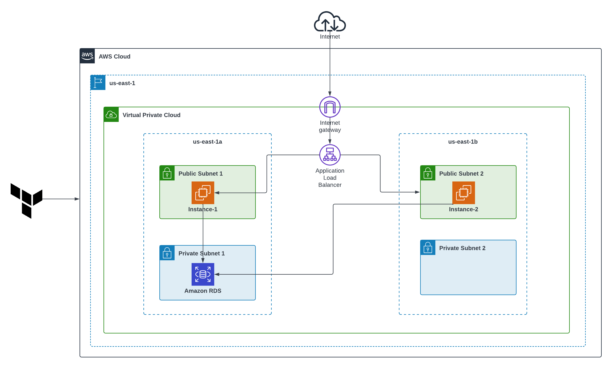

# 🏗️ Two-Tier AWS Architecture using Terraform

This project demonstrates the deployment of a highly available and scalable two-tier web application architecture on **Amazon Web Services (AWS)** using **Terraform** for Infrastructure as Code (IaC). It consists of:

- A **Web Tier** (EC2 instances running a Flask application)
- A **Database Tier** (MySQL managed by Amazon RDS)

---

## 📌 Project Architecture



The architecture is split across **two Availability Zones** for high availability and fault tolerance. Components include:

- **VPC** with public and private subnets
- **Internet Gateway & NAT Gateway**
- **EC2 Instances** in public subnets (Web Layer)
- **Application Load Balancer** for distributing traffic
- **Amazon RDS (MySQL)** in private subnets (Database Layer)
- **Security Groups** for controlled access
- **Terraform** for complete automation

---

## 🛠️ Key Features

- ✅ **Infrastructure as Code (IaC)** using Terraform
- ✅ **High Availability** via Multi-AZ setup
- ✅ **Elastic Load Balancer (ALB)** to manage web traffic
- ✅ **Amazon RDS** for reliable and managed DB operations
- ✅ **Private Subnet Isolation** for enhanced security
- ✅ **Security Groups** to control traffic flow
- ✅ **Automatic bootstrapping** of Flask app

---

## 🧰 Technologies Used

- **Terraform** - IaC tool
- **AWS EC2** - Virtual machines
- **Amazon RDS** - MySQL database
- **AWS VPC/Subnets/IGW/NAT/SG** - Networking
- **Flask** - Lightweight web app framework

---

## 🚀 Getting Started

### 📝 Prerequisites

- AWS CLI configured
- IAM user with sufficient permissions
- Terraform installed
- Key pair (for SSH access if needed)

### 📂 Project Structure

## 🧱 Project Structure

├── main.tf # Main Terraform configuration
├── variables.tf # Input variables
├── outputs.tf # Output values (optional)
├── instance.tf # EC2 instance configuration && RDS configuration
├── README.md # Project documentation
└── screenshots/ # 📸 Screenshots folder 

## 🚀 Deployment Steps

1. **Clone the repository**:
   ```bash
   git clone https://github.com/Antonyrosan/two-tier-infra-terraform.git
   cd terraform-aws-2tier-app

Initialize Terraform:

```bash
terraform init
```

Preview the plan:

```bash
terraform plan
```

Apply the configuration:

```bash
terraform apply
```

✅ VPC Created

✅ EC2 Instance Launched

✅ RDS Launched in Private Subnet

Outputs:

ec2_public_ip = "44.210.140.38"
rds_endpoint = "terraform-mysql-db.cg1ayo6w86rz.us-east-1.rds.amazonaws.com:3306"

   ```bash
   git clone https://github.com/your-username/terraform-aws-2tier-app.git
   cd terraform-aws-2tier-app/app/
```

# MySQL configuration update the db config
db = mysql.connector.connect(
    host="localhost",
    user="root",
    password="",  # add your MySQL password
    database="student_db"
)

```bash
python --version
python3 -m venv venv
source venv/bin/activate
pip install -r requerments.txt or pip install flask mysql-connector-python
python app.py
```

## Project Conclusion: Two-Tier Student Management System with Flask and MySQL
This project demonstrates the development and deployment of a two-tier architecture application using Flask and MySQL. The application serves as a Student Management System, allowing users to perform CRUD (Create, Read, Update, Delete) operations on student records through a web interface.


